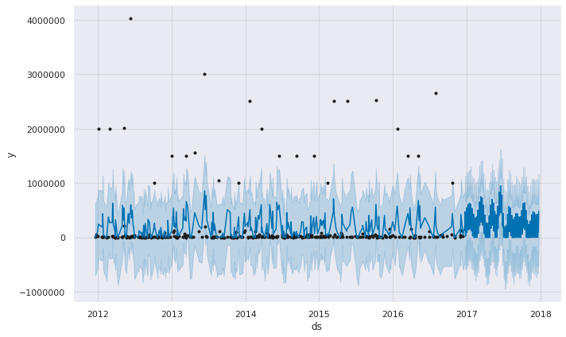
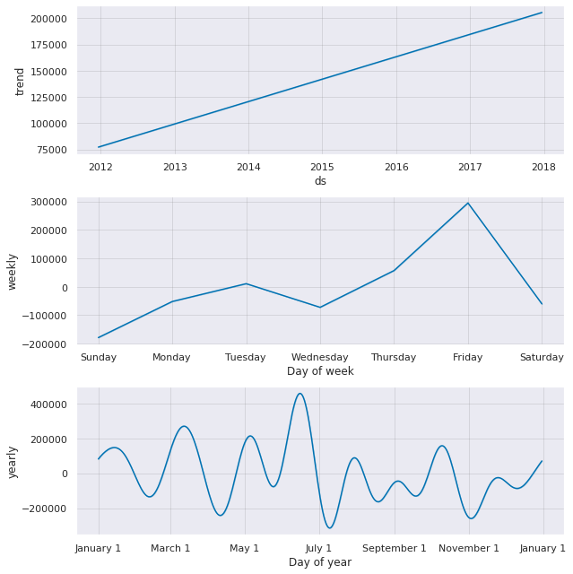

# Distribution Centre Demand Time-Series Forecasting
**Project Report**

## Abstract
Forecasting distribution centre demand at a product SKU level, utilizing Facebook's Prophet model forecasting. The time-series forecasting model takes an input of a warehouse (distribution centre) and a specified product ID (SKU). Due to disaggregation, exact model accuracy varies based on inputs. Model evaluation (forecast accuracy) is based on cross-validation metrics - specifically the Mean Absolute Percentage Error (MAPE) - reported in the results section of each forecast.

## Introduction
Supply chains typically follow stages of suppliers, manufacturers, distributors, retailers, and then customers. Forecasting is the basis of strategic and planning decisions in a supply chain. Specifically in production, it enables planning for components in likes of capacity, scheduling, inventory, and aggregate planning. This also interrelates to functions of marketing, finance, and personnel. In scope of production, this project looks at typical disaggregated planning needs which would ultimetly feed a Master Production Schedule (MPS) - individual SKUs are forecasted at specific distribution centres.

**This document outlines topics of the model's methodology, modelling tools and techniques, and provides a summary of results and final discussion points. For a detailed code repository, please see attached [Jupyter Notebook](https://github.com/kyle-walden/Distribution-Centre-Demand-Time-Series-Forecasting/blob/master/Notebook_1%20(1).ipynb) to this repository.**

## Methodology
### Dataset
The dataset obtained comprises of unique orders from four warehouses, globally located anonymously. The warehouses distribute 2160 unique products within 33 unique categories. The dataset used initially comprises of 5 vairables
* Product_Code: The product name encoded
* Warehouse: Warehouse name encoded
* Product_Category: Product Category for each Product_Code encoded
* Date: The date customer needs the product
* Order_Demand: single order qty

Data pre-processing is required to manipulate the data to feed the model. Requirements for the model are two vairables, ds and y. Where, ds is the date and y is the numeric outcome (Order_Demand). Typical forecasting methods follow aggregate planning, i.e. forecasts are generated on the "biggest" number as possible, such as forecasting monthly demand for a SKU. 

However, as stated in the next section, Facebook's Prophet algorithm typically works well with seasonal effects - from yearly down to weekly seasonal trends. In order to obtain insights on weekly trends (as will be shown later in the results) - daily data is needed. Therefore, the final processed dataset comprises of the total demand for each SKU for each recorded day (date) per warehouse. 

### Modelling
The programming language of choice was Python. Numerous libraries were used throughout the coding script, namely Pandas, NumPy, Fbprophet, Seaborn, and Matplotlib.

The time-series forecasting model used is Facebook Prophet. "Prophet is a procedure for forecasting time series data based on an additive model where non-linear trends are fit with yearly, weekly, and daily seasonality, plus holiday effects. It works best with time series that have strong seasonal effects and several seasons of historical data. Prophet is robust to missing data and shifts in the trend, and typically handles outliers well." ([Facebook](https://facebook.github.io/prophet/), 2019).

## Results
As stated, the input for the forecasting model is historical demand for a specified individual SKU and distribution centre (warehouse). Therefore, all results shown below report such an input. In the case of the below results, the input was 'Product_1359' for 'Warehouse_S'. 

**Fig 1. Modelled Forecast Plot of Predictive Dataframe**. A 365 day - one year - forecast was produced.

**Fig. 2. Overall Trend, Yearly Seasonality, and Weekly Seasonality.**

![MAPE_CV_Metric.png.png]!(MAPE_CV_Metric.png.png)
**Fig 3. MAPE Plot.** Dots show the absolute percent error for each prediction in cross-validation dataframe. The blue line shows the MAPE, where the mean is taken over a rolling window of the dots.

The cross-validation assessment was based on a performance horizon of 365 days, starting with 730 days of training data in the first cutoff and then making predictions every 180 days. In this case, making 5 total forecasts within the given time period. 

In the case of this given product and warehouse input, a 33.17% MAPE (error) was achieved. 

## Discussion
* As stated, the performance of the model is dependant on the inputs
* A better-developed model would be achieved if holiday effects (calender holidays) were inputed as parameters in the model. Since the warehouse locations are anonymous, inputting such a parameter in this project is void.
